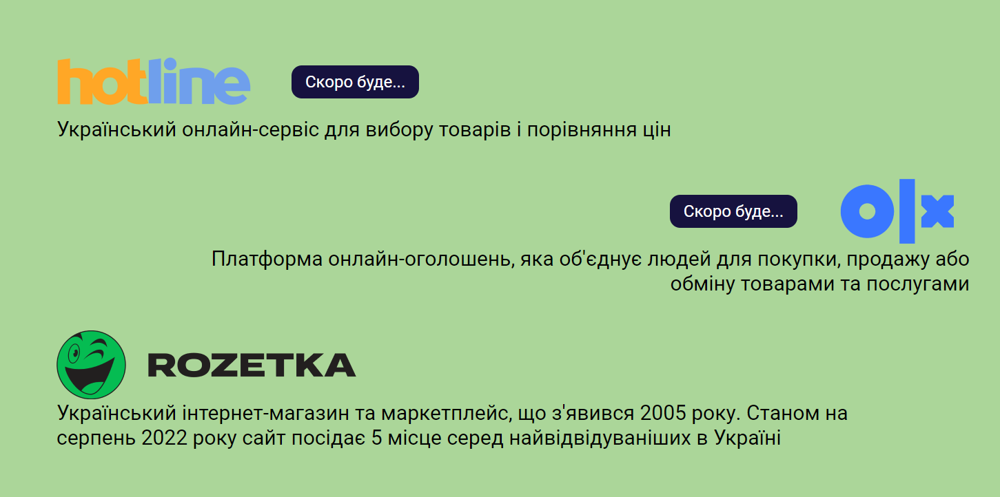
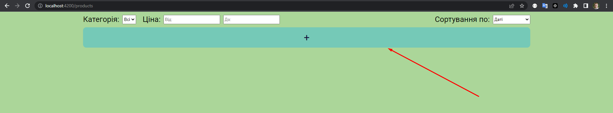
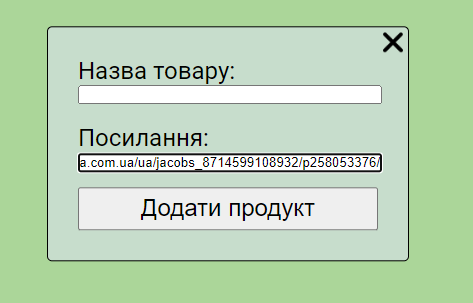
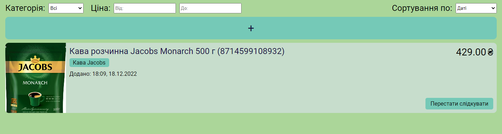

# LowPriceCatcher

## Запуск

Для того щоб запустити цей сайт вам потрібно виконати кілька простих дій:

1. Встановити [NodeJS](https://nodejs.org/dist/v18.12.1/node-v18.12.1-x64.msi)
2. Встановити [Git](https://git-scm.com/downloads)
3. Зайти в папку в яку хочете завантажити репозиторій
4. Відкрити консоль
5. Завантажити репозиторій на ПК. Команда: `git clone https://github.com/Donnle/low_price_catcher.git`
6. Зайти в папку \*your_dir\*/low_price_catcher
7. Відкрити консоль
8. Завантажити всі необхідні пакети. Команда: `npm install`
9. Запустити сайт. Команда: `npm run start:proxy`
10. !!! Не закривати консоль !!!
11. Зайти в папку \*your_dir\*/low_price_catcher/api
12. Відкрити консоль
13. Завантажити всі необхідні пакети. Команда: `npm install`
14. Запустити бекенд. Команда: `npm run start`
15. !!! Не закривати консоль !!!

Після чого переглянути сайт можна за посиланням http://localhost:4200

### Підтримуюючі сайти:

Зазвичай підтримуюючі сайти відображаютсья на головній сторінці

Зараз це:

- rozetka

### Додавання товару для відслідковування

1. Нажміть на кнопу "+"

2. Введіть назву та посилання товару

3. Товар успішно додано!

Якщо товар був доданий раніше, то нічого не відбудеться.

### Коли оновлюється ціна товару

Ціна товару оновлюється при:

- Перезагрузці сайту
- Автоматично кожної години

### Плани на майбутнє

- Зробити сповіщення в telegram
- Зробити авторизацію
- Додати інші сайти
